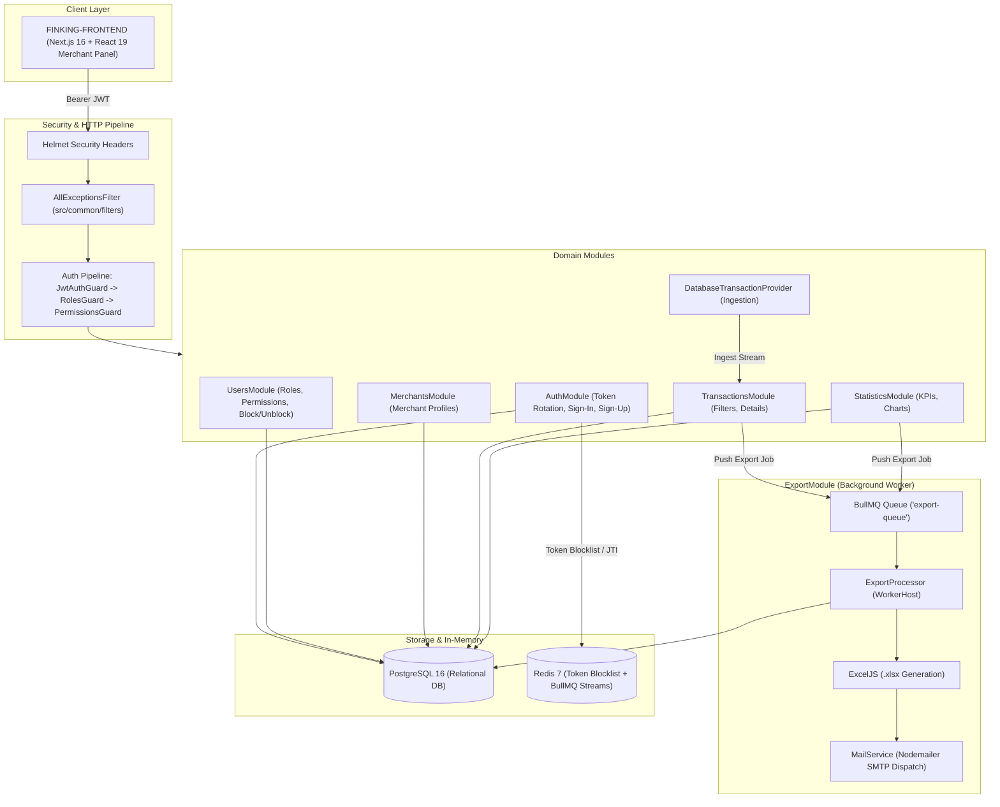

# FinKing Backend — Merchant Panel Platform

[](https://nodejs.org/)
[](https://nestjs.com/)
[](https://www.typescriptlang.org/)
[](https://www.postgresql.org/)
[](https://redis.io/)
[](https://bullmq.io/)
[](https://www.docker.com/)
[](https://jestjs.io/)
[](https://github.com/swe-rashad/FINKING-FRONTEND)

FinKing Backend is the backend system powering the **FinKing Merchant Panel**, designed for merchant management, financial operations, transaction monitoring, and multi-tier access control. Built with **Node.js** and **NestJS 11**, the platform handles asynchronous background processing with **BullMQ + Redis**, transaction ingestion, financial analytics, token rotation, and automated report generation.

Frontend Repository: https://github.com/swe-rashad/FINKING-FRONTEND


---

## Architecture Overview



---

## Core Architectural Capabilities

### 1. Authentication, Authorization & Token Management

* **Token Rotation**: Access tokens are short-lived, while refresh tokens carry unique cryptographic UUID identifiers (`jti`). Upon token refresh, the previous `jti` is immediately blacklisted in Redis with an exact TTL, preventing replay attacks and token reuse.
* **Three-Tier Authorization Chain**: Enforces granular access control through a composable pipeline: `JwtAuthGuard` -> `RolesGuard` -> `PermissionsGuard`, combining Role-Based (RBAC) and Permission-Based (PBAC) access control.
* **Active Status Enforcement**: User revocation or account suspension is checked at the guard level; blocked accounts are denied access even when using an otherwise valid token.
* **Global Exception Handling & Traceability**: `AllExceptionsFilter` intercepts unhandled runtime exceptions, hides sensitive database and ORM details from external responses, and attaches unique correlation trace IDs.
* **Security Headers**: HTTP transport security, frame protection, and content type sniffing prevention are enforced globally through **Helmet**.

### 2. Transaction Ingestion & Ledger Architecture

* **Provider Strategy Pattern**: Transactions are ingested through an abstracted `TransactionProvider` interface, separating the transaction domain from specific storage implementations and allowing integrations with external Core Banking systems, payment gateways, or POS terminal feeds.
* **Multi-Dimensional Query Filtering**: Transaction queries support filters across execution status, transaction type, multi-currency values, sender/receiver identifiers, merchant references, RRN codes, and date ranges.
* **Multi-Tenant Merchant Isolation**: Merchant accounts are scoped to their own transaction streams and related business metrics.

### 3. Background Processing with BullMQ & Redis

* **Background Queues**: Heavy workloads such as transaction exports and analytics generation are processed through Redis-backed **BullMQ** queues using the `export-queue`.
* **Dedicated Worker Processing**: Background jobs are consumed by separate `ExportProcessor` workers outside the HTTP request flow, with automated retries, error handling, and progress tracking.
* **Automated Multi-Sheet Report Generation**: Datasets are formatted, styled, and serialized into multi-worksheet `.xlsx` spreadsheets using **ExcelJS**, then sent to authenticated recipients through **Nodemailer** with email templates.

### 4. Financial Analytics & Aggregations

* **Dynamic Time-Series Analytics**: Aggregates gross revenue, transaction velocity, average transaction value (AOV), and active user metrics across dynamic time horizons (Weekly, Monthly, Yearly) using database-level time truncation with `DATE_TRUNC`.
* **Merchant Category Distribution**: Aggregates transaction volumes by business sector for financial reporting and fraud anomaly detection.
* **KPI Reporting**: Calculates summary KPIs used by administrative dashboards without requiring full-table scans.

---

## Tech Stack

| Technology        | Purpose                                 |
| ----------------- | --------------------------------------- |
| **NestJS 11**     | Backend framework                       |
| **TypeScript 5**  | Static type checking and DTO contracts  |
| **PostgreSQL 16** | Relational database                     |
| **TypeORM 1.x**   | ORM and migrations                      |
| **Redis 7**       | Token blocklist and BullMQ queue broker |
| **BullMQ**        | Background job queue                    |
| **ExcelJS**       | Excel (.xlsx) file generation           |
| **Nodemailer**    | SMTP email delivery                     |
| **Helmet**        | HTTP security headers                   |
| **Jest**          | Unit and integration testing            |

---

## Getting Started

### Option A: Using Docker Compose

Run the platform services, PostgreSQL, and Redis together:

```bash
docker compose up --build
```

The service will start at `http://localhost:3000`.

---

### Option B: Local Setup with PNPM

#### 1. Prerequisites

* Node.js 20+
* PNPM (`npm install -g pnpm`)
* PostgreSQL 16 and Redis 7 running locally

#### 2. Environment Configuration

```bash
cp .env.sample .env
```

Update `.env` with your database, Redis, and SMTP settings.

#### 3. Install Dependencies

```bash
pnpm install
```

#### 4. Run Migrations & Seeds (Optional)

```bash
pnpm db:seed
```

#### 5. Start the Server

```bash
# Development with hot-reload
pnpm start:dev

# Production build and run
pnpm build
pnpm start:prod
```

---

## Database Migrations

TypeORM CLI commands for database schema updates:

```bash
# Generate a migration based on entity changes
pnpm migration:generate src/database/migrations/YourMigrationName

# Run pending migrations
pnpm migration:run

# Revert the latest migration
pnpm migration:revert
```

---

## Running Tests

Unit tests cover services, guards, controllers, processors, and filters:

```bash
# Run all unit tests
pnpm test

# Run tests with coverage
pnpm test:cov
```

All 23 test suites and 142 unit tests pass.

---

## License

This project is licensed under the MIT License.
