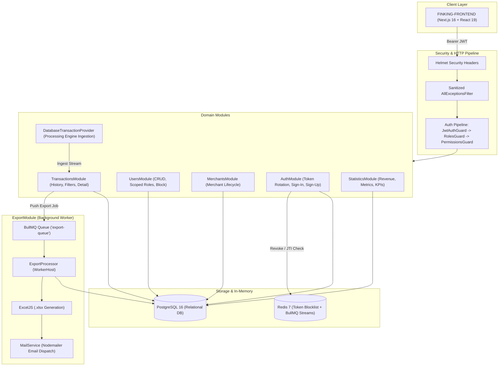

# FinKing Backend — Node.js & NestJS Financial Platform API

[](https://nodejs.org/)
[](https://nestjs.com/)
[](https://www.typescriptlang.org/)
[](https://www.postgresql.org/)
[](https://redis.io/)
[](https://bullmq.io/)
[](https://www.docker.com/)
[](https://jestjs.io/)
[](https://github.com/swe-rashad/FINKING-FRONTEND)

Production-ready financial backend for the **FinKing** B2B financial dashboard platform, built with **Node.js** and **NestJS**. Built with a decoupled domain architecture, fine-grained RBAC access control, token rotation, transaction ledger management, and asynchronous BullMQ background queue workers.

Frontend Repository: [swe-rashad/FINKING-FRONTEND](https://github.com/swe-rashad/FINKING-FRONTEND)

---

## Architecture Overview



---

## Core Capabilities

### 1. Security & RBAC
* **Role-Based Access Control**: Hierarchical role matrix (`Admin`, `Employee`, `Customer`).
* **Granular Permissions**: Decorator-driven checks (`users:read`, `users:create`, `transactions:read`, etc.).
* **Refresh Token Rotation**: Each token is minted with a unique UUID (`jti`). Using a refresh token automatically blacklists its `jti` in Redis for the remainder of its TTL, preventing replay attacks.
* **Account Status Enforcement**: Accounts in `Blocked` or `ForceChangePassword` status are blocked across authentication and session validation.
* **Data Sanitization**: `AllExceptionsFilter` strips internal database error messages, stack traces, and driver codes from client responses while retaining trace IDs for internal logs.

### 2. High-Performance Transactions & Analytics
* **Processing Provider Architecture**: Transactions are not tightly coupled database relations; they represent independent financial ledger streams ingested via `DatabaseTransactionProvider` (simulating external payment gateways, processing hosts, and terminal engines).
* Paginated transactions with composite filtering (status, date range, merchant, currency, type, RRN).
* Dedicated statistics aggregation for total revenue, volume, average transaction size, and category distribution.
* Composite database indexing for fast reads on multi-million row datasets.

### 3. Asynchronous Export with BullMQ
* Large report requests (`POST /transactions/export` & `POST /statistics/export`) validate date ranges (maximum 1 year) and return immediately (`200 OK`).
* Modular background workers (`ExportProcessor` via `ExportModule`):
  * Query datasets from PostgreSQL without blocking client HTTP threads.
  * Construct formatted `.xlsx` workbooks with **ExcelJS** (multi-sheet KPI workbooks for statistics and ledger workbooks for transactions).
  * Send branded HTML emails with reports attached via **Nodemailer**.

### 4. Database Migrations
* Clean TypeORM CLI migration setup with `src/database/data-source.ts`.
* Safe schema versioning for zero-downtime production deployments.

---

## Tech Stack

| Technology | Purpose |
|---|---|
| **NestJS 11** | Scalable enterprise Node.js framework |
| **TypeScript 5** | Strict type safety across all DTOs and models |
| **PostgreSQL 16** | Primary ACID relational database |
| **TypeORM 1.x** | Object-Relational Mapping & migration manager |
| **Redis 7** | Token blocklist storage & BullMQ job queue |
| **BullMQ** | Distributed background job queue manager |
| **ExcelJS** | Memory-efficient Excel (.xlsx) file generator |
| **Nodemailer** | Transactional email delivery engine |
| **Helmet** | HTTP security headers (OWASP best practices) |
| **Docker & Compose** | Containerized deployment with automated health checks |
| **Jest** | Unit and integration test suite |

---

## Quick Start

### Option A: Run with Docker Compose (Recommended)

Start the API, PostgreSQL, and Redis with a single command:

```bash
docker compose up --build
```

The API will be available at `http://localhost:3000`. Swagger API docs will be ready at `http://localhost:3000/api/docs`.

---

### Option B: Local Setup with PNPM

#### 1. Prerequisites
* Node.js 20+
* PNPM (`npm install -g pnpm`)
* PostgreSQL 16 & Redis 7 running locally

#### 2. Configure Environment
```bash
cp .env.sample .env
```
Update `.env` with your local database and Redis credentials.

#### 3. Install Dependencies
```bash
pnpm install
```

#### 4. Run Migrations & Seeds (Optional)
```bash
# Run database seeders (mock transactions and users)
pnpm db:seed
```

#### 5. Start the Application
```bash
# Development mode with hot-reload
pnpm start:dev

# Production mode
pnpm build
pnpm start:prod
```

---

## Database Migrations

FinKing uses TypeORM CLI migrations for safe schema evolution:

```bash
# Generate a migration based on entity changes
pnpm migration:generate src/database/migrations/YourMigrationName

# Apply pending migrations
pnpm migration:run

# Revert the last applied migration
pnpm migration:revert
```

---

## Testing

The project maintains comprehensive test coverage across services, guards, controllers, processors, and filters:

```bash
# Run all unit tests
pnpm test

# Run tests with coverage report
pnpm test:cov
```

**Test Status:** 20 test suites, 121 tests passing (100% guard coverage).

---

## API Documentation

Interactive Swagger (OpenAPI) documentation is auto-generated and available at:

```
http://localhost:3000/api/docs
```

It includes bearer token authorization, request/response schemas, and validation criteria for all endpoints.

---

## License

This project is licensed under the MIT License.
