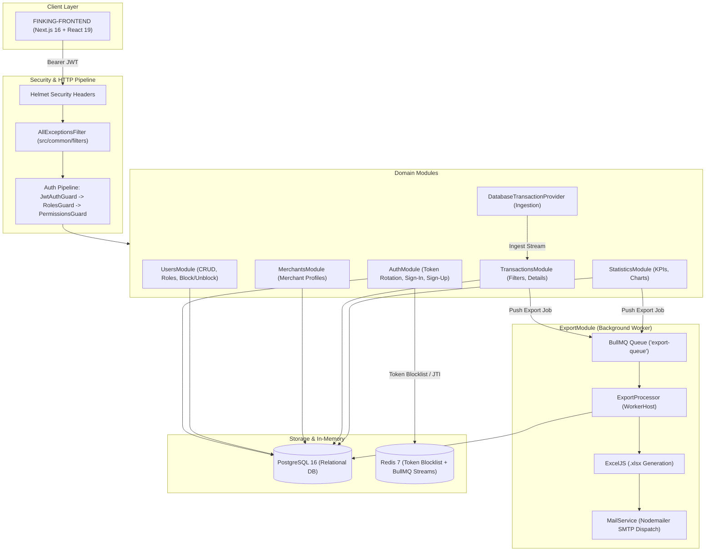

# FinKing Backend — Node.js & NestJS Financial Platform API

[](https://nodejs.org/)
[](https://nestjs.com/)
[](https://www.typescriptlang.org/)
[](https://www.postgresql.org/)
[](https://redis.io/)
[](https://bullmq.io/)
[](https://www.docker.com/)
[](https://jestjs.io/)
[](https://github.com/swe-rashad/FINKING-FRONTEND)

FinKing Backend is a RESTful API service for financial operations and reporting, built with **Node.js** and **NestJS**. It handles user authentication with JWT token rotation, role-based access control, transaction history, platform analytics, and background report exports via email.

Frontend Repository: [swe-rashad/FINKING-FRONTEND](https://github.com/swe-rashad/FINKING-FRONTEND)


---

## Architecture Overview



---

## Key Features

### 1. Authentication & Security
* **JWT with Refresh Token Rotation**: Access tokens expire in 1 day; refresh tokens use a unique UUID (`jti`). When a refresh token is used, its `jti` is stored in Redis until its TTL expires, preventing reuse.
* **Role-Based & Permission-Based Access**: Supports roles (`Admin`, `Employee`, `Customer`) and permissions (`users:read`, `users:create`, `transactions:read`, etc.).
* **Account Status Checks**: Blocked users are stopped directly at the `JwtAuthGuard` level with a 403 response.
* **Centralized Exception Handling**: `AllExceptionsFilter` catches uncaught errors, hides database error details from clients, and logs trace IDs for debugging.
* **Architectural Note on Rate Limiting**: Application-level rate limiting was omitted here. In enterprise systems, rate limiting and traffic management are handled upstream by an API Gateway (such as Kong Gateway or Cloudflare). Keeping it outside the service code simplifies local development while following microservice separation of concerns.

### 2. Transactions & Statistics
* **Transaction Ingestion**: `DatabaseTransactionProvider` simulates transactions from payment gateways and terminals, making transaction data independent from user tables.
* **Filtering & Pagination**: Query transactions by status, type, currency, sender, receiver, merchant, and date range.
* **Analytics**: Aggregates total revenue, transaction counts, average amount, and category distribution for the dashboard.

### 3. Background Job Processing (BullMQ & Redis)
* Export endpoints (`POST /transactions/export` and `POST /statistics/export`) add jobs to `export-queue` in BullMQ and return immediately.
* `ExportProcessor` runs in the background, pulls data from PostgreSQL, creates an `.xlsx` spreadsheet using **ExcelJS**, and emails it to the user with **Nodemailer**.

---

## Tech Stack

| Technology | Purpose |
|---|---|
| **NestJS 11** | Backend framework |
| **TypeScript 5** | Static type checking and DTO contracts |
| **PostgreSQL 16** | Relational database |
| **TypeORM 1.x** | ORM and migrations |
| **Redis 7** | Token blocklist and BullMQ queue broker |
| **BullMQ** | Background job queue |
| **ExcelJS** | Excel (.xlsx) file generation |
| **Nodemailer** | SMTP email delivery |
| **Helmet** | HTTP security headers |
| **Jest** | Unit and integration testing |

---

## Getting Started

### Option A: Using Docker Compose

Run the API, PostgreSQL, and Redis together:

```bash
docker compose up --build
```

The API will start at `http://localhost:3000`.

---

### Option B: Local Setup with PNPM

#### 1. Prerequisites
* Node.js 20+
* PNPM (`npm install -g pnpm`)
* PostgreSQL 16 and Redis 7 running locally

#### 2. Environment Configuration
```bash
cp .env.sample .env
```
Update `.env` with your database, Redis, and SMTP settings.

#### 3. Install Dependencies
```bash
pnpm install
```

#### 4. Run Migrations & Seeds (Optional)
```bash
pnpm db:seed
```

#### 5. Start the Server
```bash
# Development with hot-reload
pnpm start:dev

# Production build and run
pnpm build
pnpm start:prod
```

---

## Database Migrations

TypeORM CLI commands for database schema updates:

```bash
# Generate a migration based on entity changes
pnpm migration:generate src/database/migrations/YourMigrationName

# Run pending migrations
pnpm migration:run

# Revert the latest migration
pnpm migration:revert
```

---

## Running Tests

Unit tests cover services, guards, controllers, processors, and filters:

```bash
# Run all unit tests
pnpm test

# Run tests with coverage
pnpm test:cov
```

All 23 test suites and 142 unit tests pass.

---

## License

This project is licensed under the MIT License.
